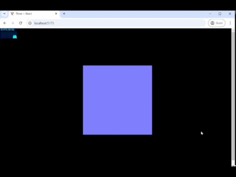
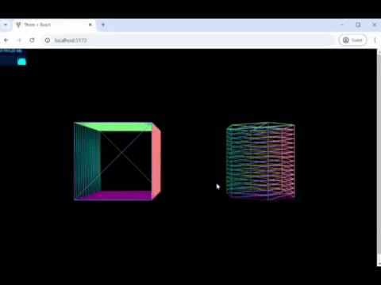
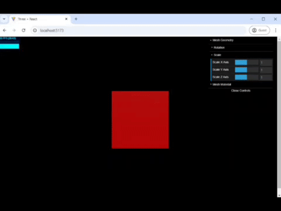

# three.js

#### JavaScript 3D Component

Three.js is a cross-browser JavaScript library and application programming interface used to create and display animated 3D computer graphics in a web browser using WebGL.

### Installation Guide

```
git clone https://github.com/zahrakhoshdel/three-js-tutorial.git
cd three-js-tutoria/
npm install
npm run dev
```

### examples

- 01 - Starting ThreeJS project - [**simple cube**](/01-setup)
  </br>Three.js setup guide - getting started with react



- 02 - Geometry - [**geometries**](/02-geometry)
  </br>Showcase "hidden" geometries




- 03 - Dat GUI -[**GUI elements**](/03-dat-gui)
  </br>Customize object parameters and change colors


